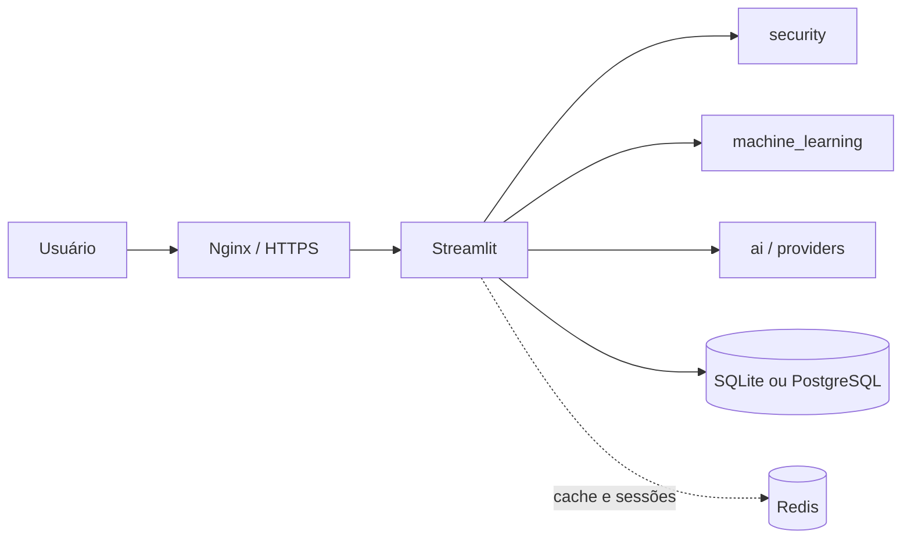

# Arquitetura do SmartDataAnalyzer

## Visão geral

O `app.py` é o ponto de entrada oficial. Ele autentica o usuário, verifica consentimento e
permissões, valida o upload e somente então encaminha o `DataFrame` aos módulos de análise.

## Diretórios

- `security/`: autenticação, RBAC, auditoria, anonimização e upload seguro.
- `machine_learning/`: carregamento, EDA, visualizações, ML e relatórios.
- `ai/` e `providers/`: contexto do dataset, prompts e adapters de LLM.
- `database/`: conexões e consultas persistentes.
- `ui/`: design system, tema global e tema Plotly.
- `src/`: camada modular compatível, com entidades, serviços e interface alternativa.
- `tests/`: testes unitários e de integração sem dependência de serviços externos.

## Fluxo de dados

1. O usuário entra e aceita o termo LGPD.
2. A aplicação verifica RBAC e rate limiting.
3. O arquivo passa por extensão, tamanho, magic bytes e detecção de fórmula.
4. Uma prévia de até 100 linhas é exibida antes do processamento completo.
5. Dados sensíveis podem ser anonimizados antes da EDA, ML ou IA.
6. Ações sensíveis são registradas no banco de auditoria.

Os adapters de IA recebem apenas um resumo estruturado quando possível. Enviar o dataset
completo aumenta a qualidade de algumas respostas, mas amplia custo e exposição; por isso,
essa alternativa não é o padrão.
